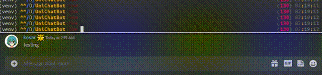

# UniChatBot: Universal chatbot based on DialoGPT

## Requirements
- Python environment 3.6
```
conda create -n unichatbot_env python=3.6
conda activate unichatbot_env
```
- python packages
```
pip install -r requirements.txt
```

## Pre-trained Models

|               Model               |                             Link to the model                             | 
|:---------------------------------:|:-------------------------------------------------------------------------:|
|              English              |      [HuggingFace](https://huggingface.co/microsoft/DialoGPT-medium)      |
|              Russian              | [HuggingFace](https://huggingface.co/Grossmend/rudialogpt3_medium_based_on_gpt2) |

## Basic usage

```
python unibot.py --lang en
```
#### Firstly it will download a chosen model.
#### After downloading it will ask you to select the source of input data.
#### Just right-click the last message in your messenger.
#### Then left-click on the input panel of your messenger to select the bot output.

### Here is a quick demo below for DISCORD:



## All available options

|     Option     |                         Description                          | Values |
|:--------------:|:------------------------------------------------------------:|:------:|
|     --lang     |                      Bot model language                      | en/ru  |
|    --memory    |            How many messages should bot remember.            |  int   |
| --max-mess-len |                Max message length in symbols.                |  int   |
| --temperature  | The more is temperature the more nonsense bot will generate. |  float |
|   --response   |    How often bot would check chat and respond in seconds     |  float |


## License
##### GNU GPL v3
